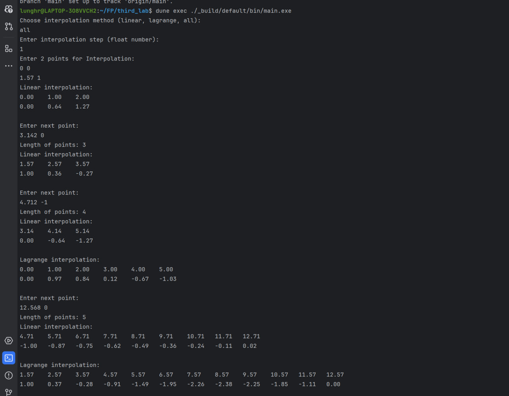

# | Lab 3 | P3309 | Тупиченко Мила |


## Цель
получить навыки работы с вводом/выводом, потоковой обработкой данных, командной строкой.

В рамках лабораторной работы вам предлагается повторно реализовать лабораторную работу по предмету "Вычислительная математика" посвящённую интерполяции (в разные годы это лабораторная работа 3 или 4) со следующими дополнениями:

## Задание
- обязательно должна быть реализована линейная интерполяция (отрезками, link);
- настройки алгоритма интерполяции и выводимых данных должны задаваться через аргументы командной строки:

  - какие алгоритмы использовать (в том числе два сразу);
  - частота дискретизации результирующих данных;
    и т.п.;

- входные данные должны задаваться в текстовом формате на подобии ".csv" (к примеру x;y\n или x\ty\n) и подаваться на стандартный ввод, входные данные должны быть отсортированы по возрастанию x;
- выходные данные должны подаваться на стандартный вывод;
- программа должна работать в потоковом режиме (пример -- cat | grep 11), это значит, что при запуске программы она должна ожидать получения данных на стандартный ввод, и, по мере получения достаточного количества данных, должна выводить рассчитанные точки в стандартный вывод;

## Основные функции

### Линейная интерполяция


```OCaml
let linear_interpolation points step =
  match points with
  | [ p1; p2 ] ->
      let x1 = p1.x and y1 = p1.y in
      let x2 = p2.x and y2 = p2.y in
      let rec generate_sequence x acc =
        match x with
        | x when x >= x2 +. step -> acc
        | _ ->
            (*            Printf.printf "x = %f\n" x; *)
            generate_sequence (x +. step)
              ({ x; y = y1 +. ((y2 -. y1) *. (x -. x1) /. (x2 -. x1)) } :: acc)
      in
      generate_sequence x1 []
  | _ -> failwith "Invalid data format for interpolation"
```


### Интерполяция Лагранжа

```OCaml
let lagrange_polynomial points x =
  List.fold_left
    (fun res i ->
      List.fold_left
        (fun res j ->
          match i <> j with
          | true -> res *. (x -. j.x) /. (i.x -. j.x)
          | false -> res)
        1. points
      *. i.y
      +. res)
    0. points

let lagrange_interpolation points step =
  let limit =
    ((List.hd (List.rev points)).x -. (List.hd points).x) /. step
    |> ceil
    |> int_of_float
  in
  List.init (limit + 1) (fun i ->
      (List.hd points).x +. (float_of_int i *. step))
  |> List.map (fun x -> { x; y = lagrange_polynomial points x })
  |> List.rev
```

## Пример вывода программы


